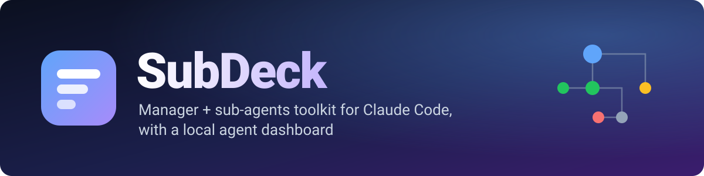
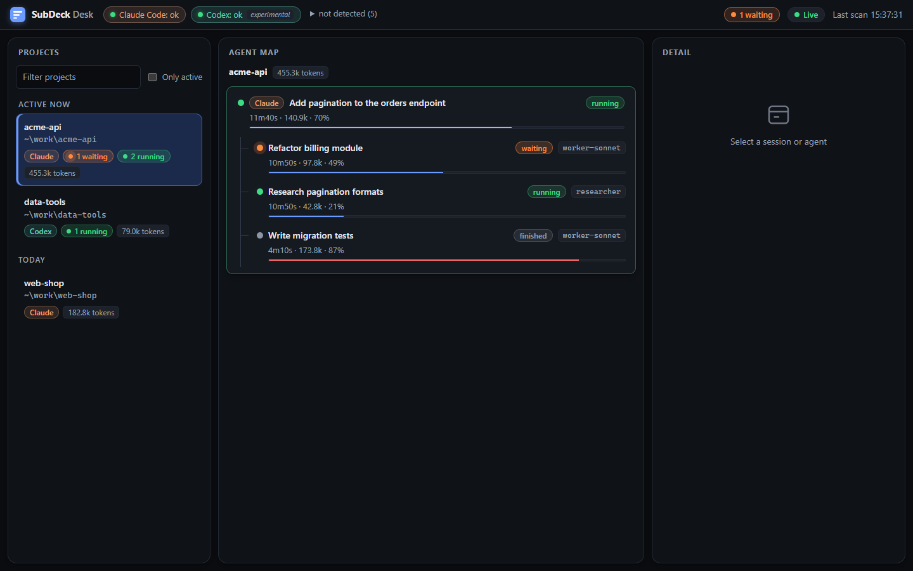
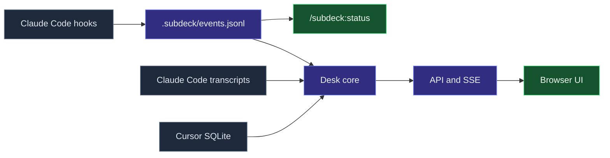
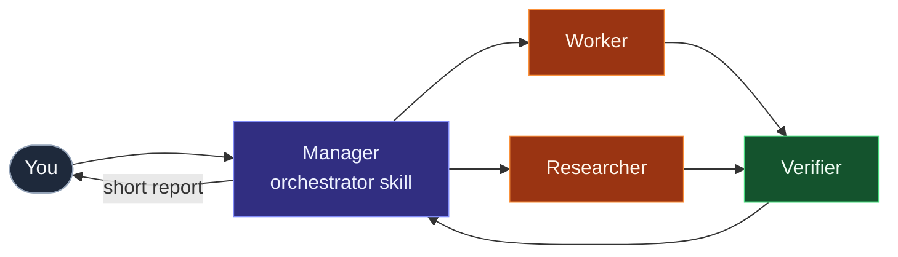

<div align="center">



<br>

[](https://github.com/emiirhandemirci)
[](https://www.linkedin.com/in/emirhan-demirci-/)


**New here? Read the [User Guide](docs/USER_GUIDE.md).**

</div>

SubDeck is a Claude Code plugin marketplace for running a **manager session with sub-agents**. The manager delegates to worker, researcher and verifier agents and reads short reports. You get a live, IDE-independent view of what every agent is doing. Everything is deterministic (hooks, bash, awk); the model is never called just to produce status.

## Install

```bash
claude plugin marketplace add emiirhandemirci/SubDeck && claude plugin install subdeck@subdeck
```

- Or run `./install.sh` (macOS, Linux, Git Bash) / `.\install.ps1` (Windows) from a clone. Both also update; add `--uninstall` / `-Uninstall` to remove.
- Inside Claude Code: `/plugin marketplace add emiirhandemirci/SubDeck`, then `/plugin install subdeck@subdeck`.
- Update: `claude plugin marketplace update subdeck && claude plugin update subdeck@subdeck`.

Restart Claude Code, then try `/subdeck:status` or `/subdeck:desk`.

## What you get

<table>
  <tr>
    <td width="33%" valign="top">🧭<br><b>Manager rulebook</b><br>Delegate, do not do the work yourself. <code>/subdeck:orchestrator</code></td>
    <td width="33%" valign="top">🤖<br><b>Seven agents</b><br>Worker (sonnet, opus, current), researcher and verifier (each with a current-model variant).</td>
    <td width="33%" valign="top">📟<br><b>Live status table</b><br>Running and finished agents in the terminal: <code>/subdeck:status</code></td>
  </tr>
  <tr>
    <td valign="top">🖥️<br><b>SubDeck Desk</b><br>Local web dashboard for Claude Code, Cursor, Codex, Copilot, Gemini, Cline/Roo and OpenCode sessions. Read-only, <code>127.0.0.1</code> only.</td>
    <td valign="top">🚦<br><b>Push gate</b><br>Pre-push checklist that asks first. It never pushes by itself. <code>/subdeck:pr</code></td>
    <td valign="top">🔔<br><b>Notifications</b><br>Local desktop notification and sound when Claude needs you or finishes. <code>/subdeck:notify</code></td>
  </tr>
  <tr>
    <td valign="top">🛡️<br><b>Guard rules</b><br>Deterministic hook: blocks <code>git add -A</code>, force push, dangerous <code>rm -rf</code>, secret files. <code>/subdeck:guard</code></td>
    <td valign="top">📊<br><b>Context usage</b><br>Desk shows how full each session's context is, and token totals per project.</td>
    <td valign="top">🪶<br><b>Zero dependencies</b><br>Bash and awk for the plugin, plain Node for Desk. No jq, no npm install.</td>
  </tr>
</table>

## SubDeck Desk

<p align="center">
  <picture>
    <source media="(prefers-color-scheme: light)" srcset="docs/assets/desk-overview-light.png">
    
  </picture>
</p>

Projects on the left, the agent tree in the middle, details on the right. Start it with `/subdeck:desk` or `node desk/server.mjs`. Claude Code and Cursor are supported; Codex, Copilot (CLI and VS Code Chat), Gemini CLI, Cline/Roo and OpenCode are **experimental** (marked in the header). Sessions that are blocked on you (permission prompt, question, plan approval) show as **waiting** and sort first. Each session shows a context-usage bar and each project its token total (tokens, not cost); paths use `~`. Details in [desk/README.md](desk/README.md).

<details>
<summary><b>Agent detail</b>: prompt, tool calls, final report</summary>
<br>
<p align="center">
  <picture>
    <source media="(prefers-color-scheme: light)" srcset="docs/assets/desk-agent-detail-light.png">
    
  </picture>
</p>
</details>

## How it fits together





## Quick start

1. Install the plugin (see below).
2. In your project, copy `plugins/subdeck/templates/CLAUDE.local.md.template` to `CLAUDE.local.md` (private, git-ignored) and fill in the placeholders. Add `.subdeck/` to `.gitignore`.
3. Start Claude Code and run `/subdeck:orchestrator`, then `/subdeck:desk` to open the dashboard.

| Command | What it does |
|---|---|
| `/subdeck:orchestrator` | Loads the manager rulebook. |
| `/subdeck:task` | Launches an agent directly, without the manager window. |
| `/subdeck:status` | Live agent table with the real model id per agent (`--all` includes finished agents). |
| `/subdeck:desk` | Starts (or prints the URL of) Desk; `stop` stops it. |
| `/subdeck:pr` | Pre-push checklist and approval gate. |
| `/subdeck:notify` | Desktop notifications: `on`, `off`, `test`, `sound`, `events`. |
| `/subdeck:guard` | Shows or changes the guard rules (`set push=off`, `reset`). |
| `/subdeck:models` | Shows or changes which model each sub-agent role uses (`/subdeck:models set worker=haiku`). |

<details>
<summary><b>Install</b></summary>

Local marketplace (persistent), inside a Claude Code session:

```
/plugin marketplace add <path-to>/SubDeck
/plugin install subdeck@subdeck
/reload-plugins
```

Same from a terminal: `claude plugin marketplace add <path-to>/SubDeck` then `claude plugin install subdeck@subdeck`. Session only, nothing installed: `claude --plugin-dir <path-to>/SubDeck/plugins/subdeck`.

Check the manifests with `claude plugin validate .` and `claude plugin validate ./plugins/subdeck`.
</details>

<details>
<summary><b>Components and requirements</b></summary>

- Agents: `worker-sonnet` (default), `worker-opus` (critical work only), `researcher` (read-only), `verifier` (no commits), plus `*-current` variants that inherit the session model.
- Hooks: `SubagentStart` / `SubagentStop` write events to `<project>/.subdeck/`; `Stop` / `Notification` send desktop notifications; `PreToolUse` runs the guard.
- Scripts: event logger, `status.sh` (bash + awk), `run-hook.cmd` (Windows/POSIX launcher). Templates: `CLAUDE.local.md.template`, `decision.md.template`.
- Requirements: Bash and awk (Git Bash on Windows), Claude Code with plugin support, git. Desk needs Node 22.13 or newer.
</details>

## Status

v0.1 (agents, hooks, status renderer, skills, templates) is implemented and was run end to end. v0.4 adds notifications, guard rules and the Desk context-usage bar. Roadmap and decision records live in `internal/design.md` and `internal/decisions/` (private, maintainers only).

## License

MIT. See [LICENSE](LICENSE).
