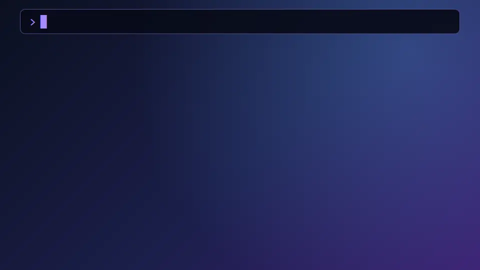
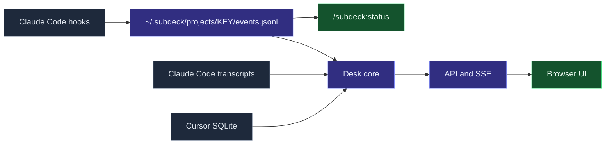

<div align="center">


<br>

[](https://github.com/emiirhandemirci)
[](https://www.linkedin.com/in/emirhan-demirci-/)


**New here? Read the [User Guide](docs/USER_GUIDE.md).**

</div>

SubDeck is a Claude Code plugin marketplace for running a **manager session with sub-agents**. The manager delegates to worker, researcher and verifier agents and reads short reports. You get a live, IDE-independent view of what every agent is doing. Everything is deterministic (hooks, bash, awk); the model is never called just to produce status.

<p align="center">
  
</p>

## Install

| Tool | Install |
|---|---|
| Claude Code | `claude plugin marketplace add emiirhandemirci/SubDeck && claude plugin install subdeck@subdeck` |
| GitHub Copilot CLI | `copilot plugin marketplace add emiirhandemirci/SubDeck && copilot plugin install subdeck@subdeck` |
| Codex | `codex plugin marketplace add emiirhandemirci/SubDeck && codex plugin add subdeck@subdeck` |
| Cursor | `./install.sh --tool cursor` (Windows: `.\install.ps1 -Tool cursor`), or in Cursor: Customize, import this repository |
| Antigravity | `./install.sh --tool antigravity` (runs `agy plugin install` on the assembled plugin), or `agy plugin install <path-to-the-assembled-plugin>` |
| Gemini CLI (legacy) | `gemini extensions install https://github.com/emiirhandemirci/SubDeck` |
| OpenCode | `./install.sh --tool opencode` (Windows: `.\install.ps1 -Tool opencode`); local install, works offline, not on npm |

Copilot gets skills, agents and hooks from the plugin itself; Codex plugins cannot bundle agents, so for Codex also run `./install.sh --tool codex` from a clone (`.\install.ps1 -Tool codex` on Windows PowerShell). `./install.sh --tool copilot` is a fallback if Copilot does not pick up the plugin's agents (add `--hooks` only if its hooks do not fire). `--uninstall` removes only the files the installer wrote. Cursor and Antigravity get the skills, the seven sub-agents and the rulebook but no guard or logging hooks; the Gemini CLI extension only loads the rulebook (`GEMINI.md`). OpenCode gets a small JS plugin (guard, event log, notifications), three commands and a rulebook pointer; it needs bash. Copilot, Codex, Cursor, Antigravity, Gemini and OpenCode support is built from the official docs and not yet live-tested; see [what works per tool](docs/USER_GUIDE.md#3-install).

- Claude Code alternatives: run `./install.sh` (macOS, Linux, Git Bash) / `.\install.ps1` (Windows) from a clone; both also update, and `--uninstall` / `-Uninstall` removes. Inside Claude Code: `/plugin marketplace add emiirhandemirci/SubDeck`, then `/plugin install subdeck@subdeck`.
- Update (Claude Code): `claude plugin marketplace update subdeck && claude plugin update subdeck@subdeck`.
- No internet on the target machine: build a USB bundle with `./make-offline-bundle.sh`; see [Offline install](docs/USER_GUIDE.md#offline-install-no-internet).

Restart the tool, then try `/subdeck:status` or `/subdeck:desk` (Claude Code).

## What you get

<table>
  <tr>
    <td width="33%" valign="top">🧭<br><b>Manager rulebook</b><br>Delegate, do not do the work yourself. <code>/subdeck:orchestrator</code></td>
    <td width="33%" valign="top">🤖<br><b>Seven agents</b><br>Worker (sonnet, opus, current), researcher and verifier (each with a current-model variant).</td>
    <td width="33%" valign="top">📟<br><b>Live status table</b><br>Running and finished agents in the terminal: <code>/subdeck:status</code></td>
  </tr>
  <tr>
    <td valign="top">🖥️<br><b>SubDeck Desk</b><br>Local web dashboard for Claude Code, Cursor, Codex, Copilot, Gemini, Cline/Roo and OpenCode sessions. Read-only, <code>127.0.0.1</code> only.</td>
    <td valign="top">🚦<br><b>Push gate</b><br>The manager runs a pre-push checklist and asks first. It never pushes by itself.</td>
    <td valign="top">🔔<br><b>Notifications</b><br>Optional, silent desktop notifications when Claude needs you or finishes. Off by default; toggle in Desk or <code>/subdeck:settings</code>.</td>
  </tr>
  <tr>
    <td valign="top">🛡️<br><b>Guard rules</b><br>Deterministic hook: blocks <code>git add -A</code>, force push, dangerous <code>rm -rf</code>, secret files. <code>/subdeck:settings</code></td>
    <td valign="top">📊<br><b>Context usage</b><br>Desk shows how full each session's context is, and token totals per project.</td>
    <td valign="top">📶<br><b>Status line</b><br>Optional agent counts in the Claude Code status bar. <code>/subdeck:settings set statusline=on</code></td>
  </tr>
  <tr>
    <td valign="top">🪶<br><b>Zero dependencies</b><br>Bash and awk for the plugin, plain Node for Desk. No jq, no npm install.</td>
  </tr>
</table>

- **Waiting list:** click the "N waiting" badge in Desk for every session blocked on you, with what it waits for and how long.
- **Changed files:** per-agent files with red/green diffs and "also changed by" badges when two agents touch the same file (Claude Code).
- **Protected paths:** `/subdeck:settings set protect=CLAUDE.md,*.lock` makes the guard ask before agents edit or delete those files.
- **Desk Settings tab and theme:** edit every setting in the browser (with confirmation before turning a guard off) and switch System / Light / Dark.
- **Independent pane scrolling:** the Desk page fills the window and each pane scrolls on its own.
- **Failure reasons:** a failed Claude Code agent shows why (API error, quota, timeout, permission, tests failed, tool error, stuck).
- **Agent commits in Changed files:** commits an agent made are listed with their `git show --stat`, on demand.
- **Resumed agents stay running:** a sub-agent that is resumed after a stop is shown as running again.
- **Branch-aware push guard:** `push=branches` (default) asks only for protected branches, tags and merges into them; force push is always denied. Notifications default to waiting and done; agent and idle are opt-in.
- **Settings help and `context`:** `/subdeck:settings help` lists every key; `context=<tokens>` sets the window for models Desk cannot size.
- **State outside the repo:** events, notification log and project settings live in `~/.subdeck/projects/`, never in your project.
- **No nested managers:** plugin agents cannot launch agents.
- **Sandbox-friendly Desk:** `SUBDECK_HOME` sets the single data root Desk reads.

## SubDeck Desk

<p align="center">
  <picture>
    <source media="(prefers-color-scheme: light)" srcset="docs/assets/desk-overview-light.png">
    
  </picture>
</p>

Projects on the left, the agent tree in the middle, details on the right. Start it with `/subdeck:desk` or `node desk/server.mjs`. Claude Code and Cursor are supported; Codex, Copilot (CLI and VS Code Chat), Gemini CLI, Cline/Roo and OpenCode support is newer and some data formats are not yet verified on every platform (hover a header badge for details). Sessions that are blocked on you (permission prompt, question, plan approval) show as **waiting** and sort first. Each session shows a context-usage bar and each project its token total (tokens, not cost); paths use `~`. Details in [desk/README.md](desk/README.md).

<details>
<summary><b>Agent detail</b>: prompt, tool calls, final report</summary>
<br>
<p align="center">
  <picture>
    <source media="(prefers-color-scheme: light)" srcset="docs/assets/desk-agent-detail-light.png">
    
  </picture>
</p>
</details>

## How it fits together




## Quick start

1. Install the plugin (see below).
2. In your project, copy `plugins/subdeck/templates/CLAUDE.local.md.template` to `CLAUDE.local.md` (private, git-ignored) and fill in the placeholders.
3. Start Claude Code and run `/subdeck:desk` to open the dashboard. The manager rulebook loads on its own when a session delegates.

SubDeck keeps its per-project records outside your project, in `~/.subdeck/projects/<name>-<hash>/` (events, notification log, status-line cache, project settings). Nothing is written into your repository, so no `.gitignore` entry is needed. `SUBDECK_STATE_DIR` moves that root; `SUBDECK_HOME` moves `~/.subdeck`. Older versions wrote `<project>/.subdeck/`; SubDeck still reads it (its project settings apply below the new ones) but never writes or deletes it. When you no longer need it: `rm -rf <project>/.subdeck`.

| Command | What it does |
|---|---|
| `/subdeck:desk` | Starts (or prints the URL of) Desk; `stop` stops it. |
| `/subdeck:status` | Live agent table with the real model id per agent (`--all` includes finished agents). |
| `/subdeck:settings` | Short table of all settings (model policy, notifications, push and guard rules, context, status line); `help`, `set key=value`, `reset`, `--project`. |

These three are the whole command surface. Launching agents and pushing go through the manager, which follows the rulebook (`/subdeck:orchestrator` opens it by hand). Coming from 0.4? `task` and `pr` are now manager rules; `models`, `notify`, `guard` and `statusline` are keys of `/subdeck:settings`. See the [User Guide](docs/USER_GUIDE.md#4-commands).

<details>
<summary><b>Install</b></summary>

Local marketplace (persistent), inside a Claude Code session:

```
/plugin marketplace add <path-to>/SubDeck
/plugin install subdeck@subdeck
/reload-plugins
```

Same from a terminal: `claude plugin marketplace add <path-to>/SubDeck` then `claude plugin install subdeck@subdeck`. Session only, nothing installed: `claude --plugin-dir <path-to>/SubDeck/plugins/subdeck`.

Check the manifests with `claude plugin validate .` and `claude plugin validate ./plugins/subdeck`.
</details>

<details>
<summary><b>Components and requirements</b></summary>

- Agents: `worker-sonnet` (default), `worker-opus` (critical work only), `researcher` (read-only), `verifier` (no commits), plus `*-current` variants that inherit the session model.
- Hooks: `SubagentStart` / `SubagentStop` write events to `~/.subdeck/projects/<name>-<hash>/`; `Stop` / `Notification` send desktop notifications; `PreToolUse` runs the guard.
- Scripts: event logger, `status.sh` (bash + awk), `run-hook.cmd` (Windows/POSIX launcher). Templates: `CLAUDE.local.md.template`, `decision.md.template`.
- Requirements: Bash and awk (Git Bash on Windows), Claude Code with plugin support, git. Desk needs Node 22.13 or newer.
</details>

## Limits

What SubDeck does not do:

- **No sandbox.** The guard is a rail, not a wall: aliases, shell globs and variables, other interpreters and scripts can get around it.
- **Copilot CLI, Codex, Cursor, Antigravity, Gemini CLI and OpenCode are not live-tested.** Support is built from the official docs; see [what works per tool](docs/USER_GUIDE.md#3-install).
- **Desk reads local files only** and may estimate a state ("running", "idle") from file activity when a tool has no hooks.
- **"Changed files" misses shell edits.** Only Write, Edit, MultiEdit and NotebookEdit calls are listed, not files written by shell commands.
- **Weak or local models may narrate instead of launching agents.** The manager rulebook assumes a model that follows tool-use instructions.
- **The status line is Claude Code only.**
- **No cost or quota tracking.** Desk shows tokens and context fill, not money or plan limits.

## Status

v0.1 (agents, hooks, status renderer, skills, templates) is implemented and was run end to end. v0.4 added notifications, guard rules and the Desk context-usage bar; v0.5 cut the commands to three; v0.6 adds the Desk Settings tab, the branch-aware push guard and state outside the repository. Roadmap and decision records live in `internal/design.md` and `internal/decisions/` (private, maintainers only).

## License

MIT. See [LICENSE](LICENSE).
