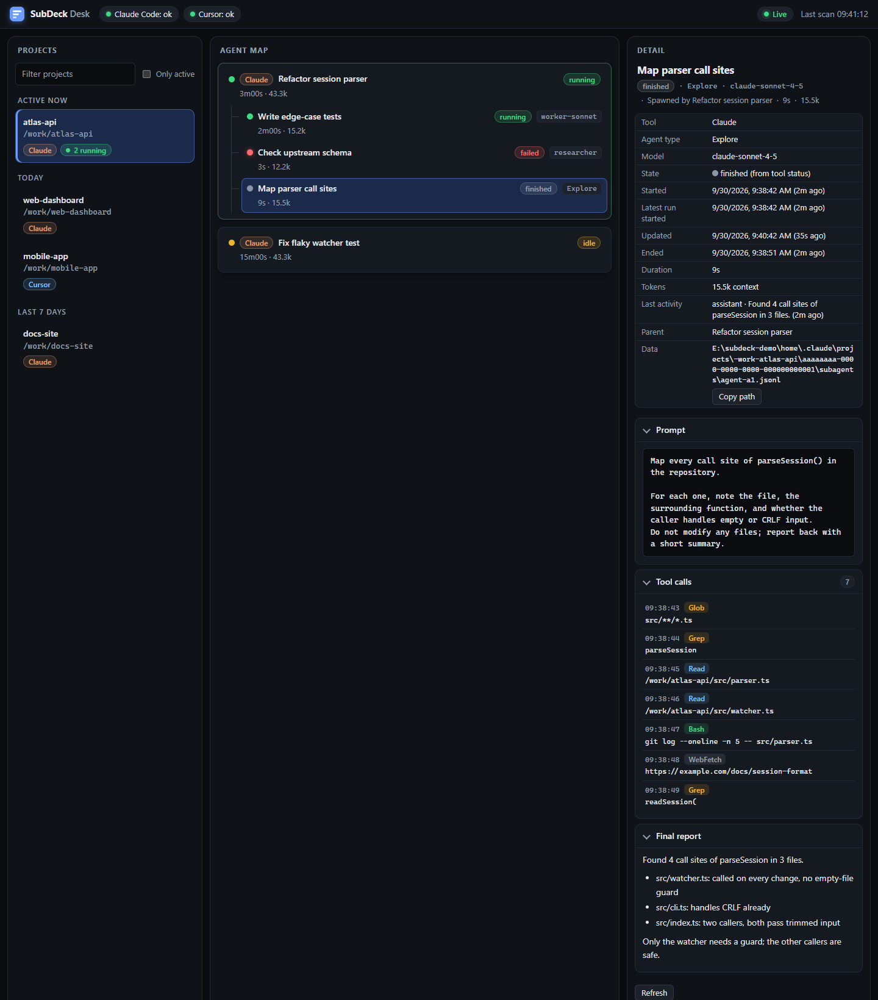

# SubDeck User Guide

## 1. What SubDeck is

SubDeck is a manager + sub-agents toolkit for Claude Code: rules, agents and skills that let one session delegate work to worker, researcher and verifier agents. Only the manager launches agents: the plugin agents have the Agent tool disabled and are told they are not the manager, so a sub-agent cannot start further agents. `/subdeck:status` shows the live agent table in the terminal, `/subdeck:settings` changes the settings. SubDeck Desk is a local web dashboard that shows the agents of Claude Code, Cursor and several other tools, like the Claude Code "Agent map" but outside the IDE.

## 2. Requirements

- Claude Code.
- Git Bash on Windows (the plugin scripts are bash).
- Node.js 22.13 or newer for Desk (Cursor support needs the built-in `node:sqlite`).

## 3. Install

**Permanent install from GitHub** (recommended), in a terminal:

```
claude plugin marketplace add emiirhandemirci/SubDeck && claude plugin install subdeck@subdeck
```

Or run `./install.sh` (macOS, Linux, Git Bash) / `.\install.ps1` (Windows PowerShell) from a clone; the script installs, or updates if SubDeck is already installed. Inside a Claude Code terminal session you can use `/plugin marketplace add emiirhandemirci/SubDeck` and `/plugin install subdeck@subdeck`. The VS Code extension has no `/plugin`, so use the terminal CLI; the plugin is then active in the extension too. Restart Claude Code afterwards.

**Update:**

```
claude plugin marketplace update subdeck && claude plugin update subdeck@subdeck
```

**Uninstall:** `claude plugin uninstall subdeck@subdeck` (or `./install.sh --uninstall` / `.\install.ps1 -Uninstall`).

Desk is found automatically in the marketplace clone under `~/.claude/plugins/marketplaces/subdeck/`.

**For plugin development** (local checkout, nothing installed):

```
claude --plugin-dir <path-to-SubDeck>/plugins/subdeck
```

or `claude plugin marketplace add <path-to-SubDeck>` followed by `claude plugin install subdeck@subdeck`.

SubDeck keeps its per-project records outside your project, in `~/.subdeck/projects/<name>-<hash>/` (events, notification log, status-line cache, project settings). Nothing is written into your repository, so no `.gitignore` entry is needed. `SUBDECK_STATE_DIR` moves that root; `SUBDECK_HOME` moves `~/.subdeck`. Older versions wrote `<project>/.subdeck/`; SubDeck still reads it (its project settings apply below the new ones) but never writes or deletes it. When you no longer need it: `rm -rf <project>/.subdeck`.

**Other tools (GitHub Copilot CLI, Codex, Cursor, Antigravity, Gemini CLI, OpenCode).** One command each installs the plugin from the same repository:

```
copilot plugin marketplace add emiirhandemirci/SubDeck && copilot plugin install subdeck@subdeck
codex plugin marketplace add emiirhandemirci/SubDeck && codex plugin add subdeck@subdeck
```

Cursor, Antigravity and Gemini CLI use files generated from the same sources (`plugins/subdeck/scripts/build-portable.sh`; a test fails if they drift):

- **Cursor.** `./install.sh --tool cursor` (Windows PowerShell: `.\install.ps1 -Tool cursor`) copies a self-contained plugin (`.cursor-plugin/`, the portable skills and the scripts they call) to `~/.cursor/plugins/local/subdeck` (respecting `CURSOR_HOME`); restart Cursor or run "Developer: Reload Window" and SubDeck shows up under Customize. Alternatively import this repository from Customize (the repository root is the plugin root, `.cursor-plugin/plugin.json`). Cursor has no install command line. Remove with `--uninstall`.
- **Antigravity (`agy`).** `./install.sh --tool antigravity` assembles the plugin (`plugin.json`, skills, seven agents, a rule, scripts) in `~/.subdeck/antigravity-plugin` (override with `SUBDECK_ANTIGRAVITY_DIR`) and runs `agy plugin install` on it when `agy` is on the PATH; otherwise it prints that command, so it also works offline. The sources are `plugins/subdeck/.antigravity/` (the scripts are added by the installer). Remove with `--uninstall` and `agy plugin uninstall subdeck`.
- **Gemini CLI (legacy, replaced by Antigravity for many users).** `gemini extensions install https://github.com/emiirhandemirci/SubDeck` (or `gemini extensions link <clone>` for a local copy) reads `gemini-extension.json` and `GEMINI.md` at the repository root; `GEMINI.md` imports the orchestrator rulebook. No agents, hooks or skills are registered for Gemini CLI; the three user skills are plain files you can ask the model to follow.
- **OpenCode.** `./install.sh --tool opencode` (Windows PowerShell: `.\install.ps1 -Tool opencode`). A small JS plugin runs the SubDeck guard, event log and notifications; three commands (`/subdeck-status`, `/subdeck-settings`, `/subdeck-desk`) and a rulebook pointer are added. It copies `subdeck.js` to `~/.config/opencode/plugins/` (respecting `OPENCODE_CONFIG_HOME`), the commands to `~/.config/opencode/commands/` and the plugin scripts to `~/.subdeck/plugin`. Add the printed line to `opencode.json` yourself, e.g. `{"instructions": ["<home>/.subdeck/plugin/skills/orchestrator/SKILL.md"]}`; the installer never edits settings files. Needs bash (Git Bash on Windows). Not published to npm: local install only, fully offline. Limits: the plugin cannot raise an approval prompt, so a guard "ask" becomes a deny with a reason; it is loaded from the plugins folder because the OpenCode docs show only npm names under `"plugin"` in `opencode.json`; exact tool argument names and the permission event payload are unverified. Remove with `--uninstall` (removes only the files above).

Codex plugins cannot bundle sub-agent definitions, so run the installer from a clone as well: `./install.sh --tool codex` (Windows PowerShell: `.\install.ps1 -Tool codex`). It writes the seven agents to `~/.codex/agents/*.toml` (respecting `CODEX_HOME`). Copilot loads skills, agents and hooks from the plugin itself; `./install.sh --tool copilot` is only a fallback that copies the agents to `~/.copilot/agents/*.agent.md` if `/agent` does not list them after the plugin install, and `--hooks` additionally writes `~/.copilot/hooks/subdeck.json` (use it only if the plugin's hooks do not fire; both together would run twice, and that file points at your clone, so keep the clone). Files the installer wrote carry a "managed by SubDeck" marker; re-running updates them, a file of the same name that is not ours is never overwritten, and `--uninstall` / `-Uninstall` removes only ours. Codex asks you to review and trust the plugin hooks the first time. Remove the plugin with `copilot plugin uninstall subdeck@subdeck` or `codex plugin remove subdeck@subdeck`.

What works and what degrades there (built from the official documentation of both tools; a live check on real installs is still pending):

| Part | Claude Code | Copilot CLI | Codex | Cursor | Antigravity |
|---|---|---|---|---|---|
| Skills (desk, status, settings, orchestrator) | slash commands `/subdeck:...` | portable skills (generated copies) | portable skills (generated copies) | portable skills | portable skills |
| Rulebook auto-loaded | SessionStart hook | SessionStart hook | SessionStart hook | always-on rule | rule file |
| Agents | bundled in the plugin | bundled in the plugin (`install.sh --tool copilot` as fallback) | `install.sh --tool codex` | plugin agents (model inherited) | plugin agents (model inherited) |
| Agent model | `sonnet` / `opus` / current | tool default (no model pinned) | tool default; `worker-opus` asks for high reasoning effort | inherited | inherited |
| Guard (blocks `git add -A`, force push, secret files, ...) | yes | yes, plugin hooks | yes; an "ask" rule becomes a deny that tells the model to ask you | no | no |
| Agent event log (feeds `status` and Desk) | yes | yes | yes | no | no |
| Notifications (off by default) | waiting, done (agent, idle opt-in) | same | same | no | no |
| Status line | optional | no | no | no | no |

Cursor and Antigravity: skills (portable copies), the seven agents (read-only agents are marked read-only; the model is inherited), and an always-on rule that points at the orchestrator skill. No guard, event log or notifications: their hook payloads differ from what the SubDeck scripts parse, so nothing is shipped rather than something unverified (hooks, `status` and Desk's agent view for those tools are not available through SubDeck). Antigravity agent model tiers (`flash`/`pro`) are not pinned.

The Claude Code skills stay as they are. Codex, Copilot, Cursor and Antigravity use generated copies in `plugins/subdeck/skills-portable/` (made by `plugins/subdeck/scripts/build-portable.sh`; a test fails if they drift): no command injection and no `CLAUDE_PLUGIN_ROOT`; the skill tells the model to run the script that sits two directories above the skill's own folder and print the output verbatim. Slash commands such as `/subdeck:status` are Claude Code only; elsewhere ask for the skill by name ("run the status skill").

Desk is tool-neutral: `node desk/server.mjs` from a clone shows the sessions of every supported tool.

Schema details used (verified against the vendors' pages, 2026-10-02; none of it live-tested): Cursor `.cursor-plugin/plugin.json` needs only `name`, components are found in default folders or custom paths in the manifest (cursor.com/docs/plugins; the exact manifest keys `skills`, `agents`, `rules` as custom paths follow that statement but were not shown in an example); Antigravity `plugin.json` needs `name`, components are discovered by folder (`skills/`, `agents/`, `rules/`) and the install source is a local path (antigravity.google/docs/plugins, /docs/subagents); Gemini `gemini-extension.json` and `contextFileName` (geminicli.com/docs/extensions/reference/). The `@file` import inside `GEMINI.md` and the staging location of Antigravity (two official pages list different folders) are not confirmed.

### Offline install (no internet)

For a machine with no internet and no GitHub access (for example an intranet PC running Claude Code against a non-Claude backend such as GLM). Transfer is by USB; nothing is downloaded at any step.

On a machine with internet and a clone of SubDeck:

1. `./make-offline-bundle.sh` (add `--ref v0.6.0` for a tag or commit). It writes `dist/SubDeck-<version>-offline.zip` from tracked files only, plus the installers, `INSTALL.cmd` and `OFFLINE-README.txt`, and prints the SHA-256. Copy the zip to the USB stick; compare the hash on the other side if you like (`Get-FileHash` / `sha256sum`).

On the offline machine (needs Claude Code, Git for Windows, and Node.js 22.13+ only for Desk):

2. Unzip anywhere and double-click `INSTALL.cmd`, or run `.\install-offline.ps1` in PowerShell (`./install-offline.sh` in Git Bash, macOS, Linux). On a non-Claude backend add `-ModeCurrent` (`--mode-current`) so sub-agents use the session's model; the installer recommends it when `ANTHROPIC_BASE_URL` points to a non-Anthropic host.
3. The installer copies the plugin to `%USERPROFILE%\.subdeck\offline\SubDeck` (`-Target` / `--target` changes it; only an older copy of ours, marked by `.subdeck-offline-install`, is ever replaced), then runs `claude plugin marketplace add <that folder>` and `claude plugin install subdeck@subdeck` (or the `update` forms when already installed). A local-directory marketplace is read in place, so Claude Code does not fetch anything.
4. Restart Claude Code, run `/subdeck:status`, then `/subdeck:desk`. Smoke test in a throwaway folder: "Use a worker to create hello.txt containing hello, then verify it."

Update: build a newer bundle, unzip it and run the installer again. Remove: `.\install-offline.ps1 -Uninstall` (`--uninstall`) removes the plugin, the marketplace entry and our copy. Desk is found through the marketplace folder Claude Code records, or the default offline target.

## 4. Commands

| Command | What it does | Example |
|---|---|---|
| `/subdeck:desk` | Starts Desk (or prints its URL if it is already running). | `/subdeck:desk` |
| `/subdeck:desk stop` | Stops Desk. `status` prints the URL or says it is not running. | `/subdeck:desk stop` |
| `/subdeck:status` | Prints the live table of running and recently finished sub-agents, including the real model id (MODEL column; on narrow terminals ACTIVITY is dropped first, then MODEL). `--all` shows more. | `/subdeck:status --all` |
| `/subdeck:settings` | A short grouped table of the settings (model policy, notifications, push and guard rules, context, status line). `help` lists every key with its values, `set key=value ...` changes them, `reset` restores defaults, `--project` writes to this project only. | `/subdeck:settings set notify=on worker=opus` |

That is the whole user-facing surface: three commands. The manager rulebook (delegation, task template, git rules, the pre-push checklist and approval gate) loads automatically and can also be opened with `/subdeck:orchestrator`. You launch agents and ask for pushes by talking to the manager.

**What replaced the old commands (migration from 0.4).**

| Old command | Now |
|---|---|
| `/subdeck:task` | Ask the manager for the work; it launches the right agent with an explicit model. |
| `/subdeck:pr` | Ask the manager to push or open a PR; it runs the pre-push checklist and waits for your explicit yes. |
| `/subdeck:models set worker=opus` | `/subdeck:settings set worker=opus` |
| `/subdeck:notify on`, `events ...` | `/subdeck:settings set notify=on notify.events=waiting,done` (or the toggle in Desk) |
| `/subdeck:guard set push=off` | `/subdeck:settings set push=off` (`guard=on` or `guard=off` for the whole guard) |
| `/subdeck:statusline` | `/subdeck:settings set statusline=on` (or `off`) |

## 5. SubDeck Desk

**Start.** Run `/subdeck:desk`, or from a SubDeck checkout:

```
node desk/server.mjs --open
```

Desk serves on `http://127.0.0.1:4917` by default (it falls back to 4918-4936 if that port is busy).

**Open it in VS Code.** Command Palette, then "Simple Browser: Show", then paste `http://127.0.0.1:4917` (or the URL that `/subdeck:desk` printed).

**Supported tools.** Claude Code and Cursor are supported. Codex, Copilot (CLI and VS Code Chat), Gemini CLI, Cline/Roo and OpenCode support is newer; some of their data formats are not yet verified on every platform. Hover a tool badge in the header for details. Tools that are not installed are hidden behind a collapsed "not detected" hint. Each tool has its own badge colour.

| Tool | "Running" means |
|---|---|
| Claude Code | A hook saw an agent start with no stop, or the transcript changed in the last 2 minutes. A resumed sub-agent counts as running again: a later start, or transcript records newer than its stop. |
| Cursor | The composer is generating, or its data changed in the last 2 minutes. |
| Codex | A turn is open in the rollout file and it was updated in the last 5 minutes. |
| Copilot | CLI: an open turn while the session's lock file belongs to a live process. VS Code Chat: recent file activity. |
| Gemini CLI | The session file changed in the last 2 minutes. |
| Cline/Roo | The task is not completed and its data changed in the last 2 minutes. |
| OpenCode | An assistant message is still open and the session was updated in the last 5 minutes. |

**Three panes.**

- **Projects** (left): projects with recent sessions; filter by name, or tick "Only active".
- **Agent map** (middle): sessions and their sub-agents as a tree.
- **Detail** (right): the selected session or agent.

The page fills the window and each pane scrolls on its own, so the header and the other panes stay put; scroll positions are kept when the data refreshes.

**Settings tab and theme.** The **Settings** tab (next to Sessions) edits the same settings as `/subdeck:settings`: selects, switches, list chips and number boxes, with a tag showing where each value comes from (default, user, project) and a scope switch for All projects or This project. Turning the push gate or a guard rule off asks for confirmation first. The status line row is read-only (change it from Claude Code). The header has a System / Light / Dark switch; the choice is remembered in the browser.

**State colours.**

| State | Colour | Meaning |
|---|---|---|
| 🟢 running | green | Activity in the last 2 minutes, or a hook saw a start with no stop. |
| 🟠 waiting | orange | Blocked on you: a permission prompt, a question or a plan approval. Waiting sessions sort first, and the header shows how many are waiting in total. |
| 🟡 idle | amber | Last activity within 30 minutes. |
| ⚪ finished | grey | Older, or the agent explicitly completed. |
| 🔴 failed | red | Explicit failure or an API error. A failed Claude Code agent shows a short reason badge (API error, quota, timeout, permission, tests failed, tool error, stuck); the detail is in its tooltip. |
| ⚪❔ stale | grey with `?` | A start was seen but no stop, and the file has been untouched for 5 minutes. State is uncertain. |

Each agent also shows where its state came from. "Estimated from file activity" means there was no hook or explicit status, so Desk guessed from how recently the session file changed. "From lock file" (Copilot CLI) means the session's lock file is held by a live process.

**Waiting list.** The header "N waiting" badge is a button. It opens a compact list of every waiting session and agent across all projects and tools: tool, project, title, what it waits for (permission, question or plan approval, when the data says which) and for how long. Click an entry to jump to it; Esc closes the list. It shows titles and metadata only, never prompt content.

**Changed files (Claude Code).** The agent detail has a collapsed "Changed files" section built from the agent's Write, Edit, MultiEdit and NotebookEdit calls (failed calls are dropped). Click a file for a red/green diff of each edit; a Write shows its full new content. Commits the agent made with `git commit` also show up: files named in its `git commit -- <paths>` appear marked "via commit", and a Commits list shows each commit; click one for its `git show --stat` (file names and counts only, read-only, on demand). When two or more agents of the same session changed the same file, it is badged "also changed by <agent>" and listed in a conflict strip at the top of the detail, so you can spot overlapping work early. Files changed through shell commands (`sed -i`, redirections, scripts) are not listed. Secret-looking files (`.env`, keys, credentials) are listed but their contents are withheld, and `--no-content` turns the feature off.

**Sandboxes and tests.** `SUBDECK_HOME` sets the single data root Desk reads (default: `USERPROFILE` on Windows, `HOME` elsewhere). With it set, Desk reads only below that folder and ignores the ambient `APPDATA`, `LOCALAPPDATA` and `XDG_*` variables.

**Agent content.** Click an agent to open it. The detail pane has three sections: **Prompt** (what it was asked), **Tool calls** (tool name and target), and **Final report** (its last message).

**Flags.**

| Flag | Meaning |
|---|---|
| `--port N` | Use exactly this port (exit 1 if busy). `0` picks any free port. |
| `--days N` | Retention window in days, 1-365 (default 14). |
| `--no-content` | Disable the prompt / tool calls / final report endpoint. |
| `--open` | Open the browser after starting. |

**Context usage.** Each session and agent row has a thin bar: the last known context tokens divided by the model's window. Claude models are measured against their real window: Opus 4.7 and later, Sonnet 5 and later and Fable/Mythos against 1M, older models (Haiku, Sonnet 4.5 and earlier, Opus 4.5 and earlier) against 200k; a `[1m]` marker or a context above 200k also means 1M. When Desk cannot know the window (Opus or Sonnet 4.6 without a visible marker, bare aliases, unrecognised ids) and for other tools, it shows just the token count. The bar is neutral below 60%, amber from 60 to 85%, red above 85%, and the percentage is always printed. Each project shows the total tokens of its sessions and agents in the retention window. These are tokens, not cost, and the totals are approximate (per-session context can overlap across turns). Tools that report no usage show nothing.

**Paths.** Desk never shows your home directory: paths in the project list, tooltips and the session "Data" row start with `~`, and a home directory inside free text (session titles, summaries, last activity, tool-call targets, prompts, final reports) is shown as `~` too. "Copy path" still copies the full real path.

**Stop.** `/subdeck:desk stop`.

Example view (agent detail with Prompt, Tool calls and Final report expanded; synthetic data):

<p align="center">
  <picture>
    <source media="(prefers-color-scheme: light)" srcset="assets/desk-agent-detail-light.png">
    
  </picture>
</p>

## 6. Settings: models

SubDeck picks the model of each sub-agent role from a small policy. Defaults: workers, researchers, verifiers and Explore on Sonnet, the escalation worker on Opus. SubDeck never picks Haiku by itself; you can still set it per role. Your own (manager) model is separate: switch it with `/model`.

Show every setting, with the source of each value (default, user or project):

```
/subdeck:settings
```

Change it:

```
/subdeck:settings set worker=haiku verifier=opus
/subdeck:settings set worker=claude-sonnet-5-5 --project
/subdeck:settings set mode=current
/subdeck:settings reset [--project]
```

- Roles: `worker`, `escalation`, `researcher`, `verifier`, `explore`. `mode` is `auto` (default), `named` or `current`.
- Values: `sonnet`, `opus`, `haiku`, `fable`, `inherit` (use the session's model), or a full model id such as `claude-sonnet-5-5`. Other ids are accepted as free text for non-Claude backends.
- `context=<tokens>` sets the context window Desk uses for models whose size it cannot know (`0` = automatic).
- `/subdeck:settings help` lists every key with its allowed values and examples. A `set` with any invalid key or value changes nothing and exits with code 2.
- Files: `~/.subdeck/config.json` (all projects) and `~/.subdeck/projects/<name>-<hash>/config.json` (this project, wins; a legacy `<project>/.subdeck/config.json` is still read below it). Both are local; do not commit them.
- Aliases follow the latest model, so `sonnet` upgrades automatically. A full id pins a version. To remap an alias, set `ANTHROPIC_DEFAULT_SONNET_MODEL` (and `_OPUS_`, `_HAIKU_`) in your Claude Code settings `env`.
- The real model id used by an agent shows in Desk and `/subdeck:status`.
- Invalid keys or values are rejected and nothing is written. If `CLAUDE_CODE_SUBAGENT_MODEL_FORCE` is set (or an organization `availableModels` list applies), Claude Code overrides the policy and `/subdeck:settings` prints a warning.

## 7. Using a non-Claude model (e.g. GLM)

Normally the plugin agents pin `model: sonnet` or `model: opus`. If you run Claude Code against another backend (for example GLM through an Anthropic-compatible `ANTHROPIC_BASE_URL`), those aliases may not resolve. SubDeck therefore has a **model mode**:

- `named`: the existing agents with pinned models (`worker-sonnet`, `worker-opus`, `researcher`, `verifier`).
- `current`: the inherit agents `worker-current`, `researcher-current`, `verifier-current`. They have `model: inherit`, so they run on whatever model the session uses. There is no cheap/expensive split and no opus escalation in this mode.
- `auto` (default): the manager picks `current` when its own model id is not a Claude model, when `ANTHROPIC_BASE_URL` points to a non-Anthropic host, or when a named agent fails to start because its model is unavailable; otherwise `named`. It states the chosen mode once per session.

To force a mode, put `Model mode: auto|named|current` in your project's `CLAUDE.local.md` (the template has the line). In `current` mode the manager launches the inherit agents for you.

Optional: instead of using the `*-current` agents, you can remap the aliases so `sonnet` and `opus` resolve to your backend's models, with `ANTHROPIC_DEFAULT_SONNET_MODEL`, `ANTHROPIC_DEFAULT_OPUS_MODEL`, `ANTHROPIC_DEFAULT_HAIKU_MODEL` (each takes a full model name), or set `CLAUDE_CODE_SUBAGENT_MODEL` for sub-agents without a model of their own. Sources: [model configuration](https://code.claude.com/docs/en/model-config) (environment variables) and [sub-agents](https://code.claude.com/docs/en/sub-agents) (`model` accepts an alias, a full model ID, or `inherit`, "use the same model as the main conversation"; resolution order).

Note: the agent prompts were tuned on Claude. Behaviour on other models is untested.

## 8. Settings: notifications

Notifications are off by default and silent (no sound). When you switch them on, SubDeck shows a local desktop notification when Claude needs your input (permission prompts, questions) and when the manager finishes its turn. Two more kinds are opt-in: `agent` (a sub-agent finished) and `idle` (the idle reminder). Several notifications for one session within 10 seconds collapse into one, keeping the most important kind (waiting, then done, then agent, then idle). `SUBDECK_NOTIFY_COLLAPSE=<seconds>` changes the window, `0` turns the collapse off; sub-agent stops without a type or transcript are ignored. Nothing leaves your machine; the notification shows only the project folder name and a short reason, never prompt content.

```
/subdeck:settings                          # show settings
/subdeck:settings set notify=on             # or notify=off; also a toggle in Desk
/subdeck:settings set notify.events=waiting,done,agent,idle   # default: waiting,done
```

Add `--project` to write the project config instead of the user config (project wins). Set the environment variable `SUBDECK_NOTIFY=0` to silence everything. Config: `{"notify":{"enabled":true,"events":["waiting","done"]}}` in `~/.subdeck/config.json` or the project config in `~/.subdeck/projects/<name>-<hash>/config.json`. Windows uses a toast (balloon fallback), macOS `osascript`, Linux `notify-send` if installed. On Windows, Focus Assist / Do Not Disturb can hide toasts; if nothing shows, check those settings.

## 9. Settings: guard rules

SubDeck ships a deterministic PreToolUse hook. It makes no model call and adds about 0.1 s per tool call. It checks Bash, PowerShell, Write, Edit and MultiEdit calls against these rules:

| Rule | Default | Blocks |
|---|---|---|
| `git-add-all` | deny | `git add -A/--all/-u/.`, `git commit -a` |
| `force-push` | deny | `git push --force`, `-f`, `--force-with-lease`, `+refspec` |
| `push` | branches | `git push`; mode `branches` asks only for protected branches and tags (see below), `ask` asks for every push, `off` allows them |
| `history-rewrite` | ask | `git reset --hard`, `rebase`, `filter-branch/filter-repo`, `clean -f` |
| `rm-rf-danger` | deny | recursive delete of `/`, a drive root, `~`/`$HOME`, the project root or their parents |
| `secret-files` | ask | Write/Edit of `.env*` (not `.env.example`), `*.pem`, `*.key`, `id_rsa*`, `id_ed25519*`, `credentials*.json` |
| `attribution` | off | `git commit` messages containing `Co-Authored-By` or "Generated with" |

- `/subdeck:settings` shows the effective rules.
- `/subdeck:settings set push=off attribution=deny [--project]`, `guard=on` or `guard=off`, and `reset [--project]` change them. They write the `guard` key of `~/.subdeck/config.json` or the project config in `~/.subdeck/projects/<name>-<hash>/config.json`; the project file wins.
- `SUBDECK_GUARD=0` disables the guard for a session.
- In auto mode, "ask" acts as "deny": with the default `branches` mode an auto-mode agent can push to a feature branch, but never to a protected branch or a tag, and never force-push.
- Rule ids that SubDeck does not recognise (for example from a newer version) are kept when `set` rewrites your config, and `show` lists them as "unknown (ignored)". They have no effect; `set <unknown-id>=...` is rejected. `reset` removes the whole `guard` key.
- It is a guard rail, not a sandbox. Aliases, scripts and other interpreters can get around it.

**Push modes and protected branches.** `/subdeck:settings set push=ask|branches|off`. The default, `branches`, lets pushes to feature branches through and asks for: a push to a protected branch (explicit refspec, `HEAD`, `src:dst`, a delete), any tag push (`--tags`, `--follow-tags`, `refs/tags/...`), `--all` / `--mirror`, and a `merge`, `rebase` or `reset` while the current branch is protected. `ask` asks for every push; `off` allows every push. Force pushes are always denied, in every mode. Protected branches default to `main`, `master`, `release/*`; change them with `/subdeck:settings set protect-branches=main,develop,release/*` (globs with `*` and `?`, matched against the branch name; a project list replaces the user list). An asked push still needs your explicit yes in the conversation. `git pull` into a protected branch is not covered.

**Protected paths.** Name files or globs your agents must not change without asking: `/subdeck:settings set protect=CLAUDE.md,.github/workflows/**,migrations/**,*.lock` (add `--project` for this repository only; `unprotect=<glob>` removes one). The guard then asks before Write/Edit/MultiEdit/apply_patch on those paths and before obvious shell writes or deletes (`>`, `>>`, `rm`, `mv`, `sed -i`, `git rm`, `git checkout -- <path>`). Globs are relative to the project root, case-insensitive on Windows; a glob without `/` matches the name at any depth, `**` crosses folders. Change the mode with `protected-paths=deny|ask|off`. The list lives in `guard.protectedPaths` in `~/.subdeck/config.json` or the project config in `~/.subdeck/projects/<name>-<hash>/config.json` (project wins). This is a guard rail, not a sandbox: shell globs and variables, other interpreters (python, node, perl), editors and scripts can still change protected files.

## 10. Settings: status line

`/subdeck:settings set statusline=on` adds an optional line to the Claude Code status bar with the agent counts of the current project, for example `SubDeck ● 2 running  ◐ 1 waiting  ✕ 1 failed`. Groups with a zero count are hidden; an idle project shows just `SubDeck`. The counts use the same waiting and stale rules as `/subdeck:status`.

- **Install.** The command edits `statusLine` in `~/.claude/settings.json` only after you confirm, and keeps all other keys.
- **Chaining.** If you already have a status line, it offers to chain: your old command keeps running and its first line is appended after ` | ` (`SUBDECK_STATUSLINE_CHAIN`).
- **Environment.** `SUBDECK_ASCII=1` uses ASCII symbols, `NO_COLOR` turns colours off, `SUBDECK_STATUSLINE_TTL` sets how many seconds the counts are cached (default 3, `0` turns the cache off).
- **Remove.** `/subdeck:settings set statusline=off` explains how to undo it: delete the `statusLine` key, or restore the chained command.
- **States.** The terminal table (`/subdeck:status`) and the status line show running, waiting, stale and done. Desk also distinguishes failed and idle, because it reads more tools.

## 11. Privacy

- Local only: Desk binds `127.0.0.1` and rejects requests with a foreign `Host` header.
- Prompt, tool calls and final report are read from your local transcript only when you open an agent. They are never stored, cached or logged; tool output and thinking text are never served.
- Start with `--no-content` to turn content reading off completely.

## 12. Troubleshooting

**Desk says it is already running.** Only one instance runs at a time. Open the printed URL, or run `/subdeck:desk stop` and start again.

**`claude` not found.** Add the folder that contains the Claude Code executable to your `PATH`, then open a new terminal.

**A tool is missing in the header.** Tools that Desk cannot find are listed under "not detected". Codex, Copilot, Gemini, Cline/Roo and OpenCode read their standard data folders; if yours live elsewhere see the environment overrides in [desk/README.md](../desk/README.md). OpenCode and Codex also need Node 22.13 or newer.

**Cursor shows nothing.** Check that Node is 22.13 or newer (`node --version`) and that Cursor has been used on this machine, so its data directory exists.

**An agent looks idle but is finished.** Update to the latest SubDeck and restart Desk (`/subdeck:desk stop`, then `/subdeck:desk`). Older versions guessed completion from file activity only.

**States look wrong for projects without the plugin.** In projects where the plugin is installed, hooks record exact start and stop events. Without it, Desk falls back to session files and file activity, so states are estimates and can lag by a few minutes.

## 13. Where to learn more

- [desk/README.md](../desk/README.md) for Desk internals, data sources and environment overrides.
